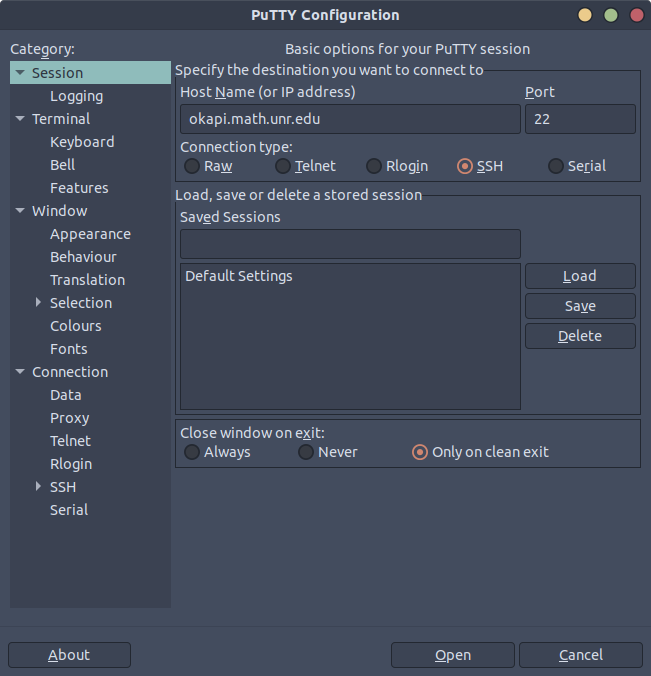
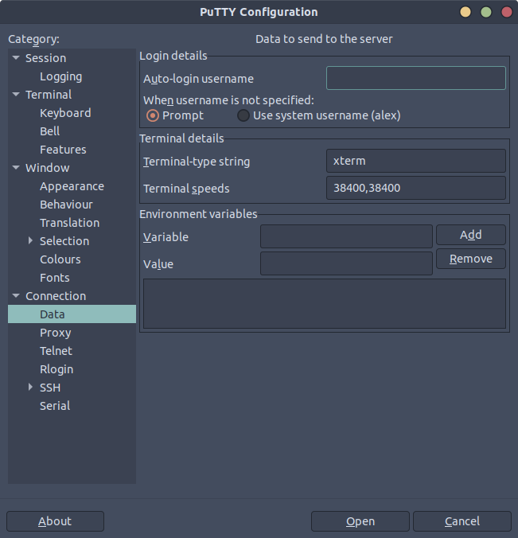
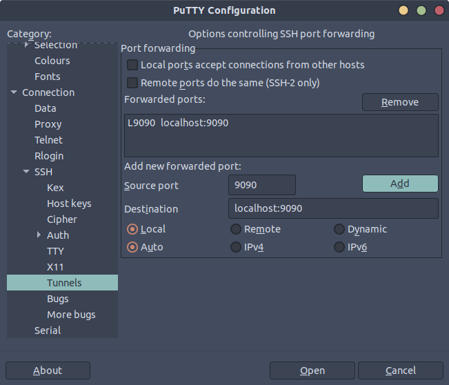
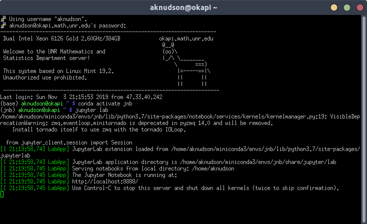

# Connecting to the Jupyter Notebook

1. Connect to the server with port forwarding
  - Set the Host Name to `okapi.math.unr.edu`
  


  - Under `Connection > Data`, set the `Auto-login username` to your Okapi server username



  - Under `Connection > SSH > Tunnels`, add a new forwarded port
  - The source port should be the one you set when installing jupyter notebooks, or the default port: `8888`
  - The destination should be `localhost:####` where `####` is the port from above
  


  - Go back to `Session` and save the settings
  - Enter a name for Saved Sessions and hit 'save'


2. Open up a jupyter notebook
  - Hit `open` on the PuTTY screen
  - Now you should see a terminal asking you to enter your password
  - Activate whichever conda environment has the jupyter notebook installation
  - Start jupyter notebook (or jupyter lab)

```bash
conda activate base
jupyter notebook
```


  
  - Read the output of the server. If you set up a password, you can skip to step 4

3. Copy the jupyter notebook address that contains the token
  - It will look something like 
    - `http://localhost:8888/?token=58479cde25979cd3ecd85932969e2e9b0fa931c71452a822`
  - Copy this address (from your own terminal) and go to the next step
    - Make sure to use `Ctr+Shift+C` to copy
  
4. Open up a browser on your local machine
  - If you set up a password, then navigate to `localhost:9090`
    - Or whatever port you have set up
  - If not, paste the address that you copied in step 3